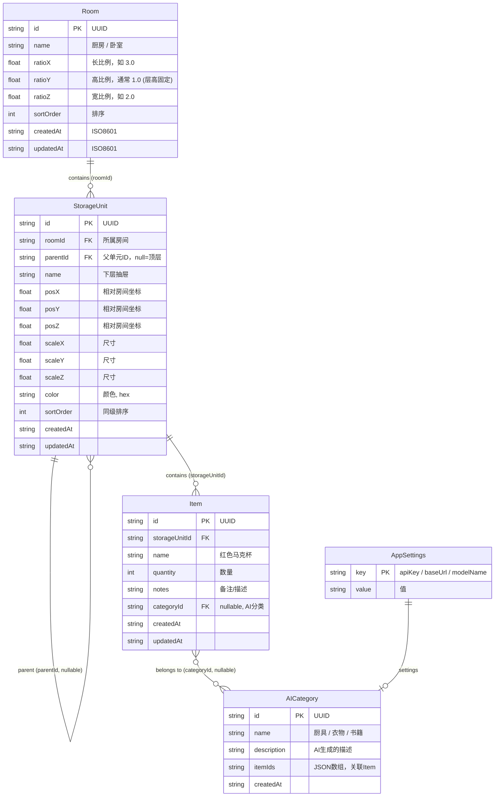

# 家庭物品管理 App — 产品需求与架构设计文档

> **文档版本**：v1.3  
> **创建日期**：2026-06-10  
> **状态**：v1.2 基础 + 工作流重构（三阶段模型：计划→开发迭代→用户触发推送）  
> **用途**：作为项目的"记忆核心"，指导 OpenCode 分步开发

---

## 目录

1. [产品概述](#1-产品概述)
2. [MVP 功能范围](#2-mvp-功能范围)
3. [技术架构方案](#3-技术架构方案)
4. [数据模型设计](#4-数据模型设计)
5. [核心交互流程详细拆解](#5-核心交互流程详细拆解)
6. [UI/UX 视觉风格建议](#6-uiux-视觉风格建议)
7. [风险与简化方案](#7-风险与简化方案)
8. [分阶段开发排期](#8-分阶段开发排期)
9. [快速原型验证与测试方法](#9-快速原型验证与测试方法)
10. [后续迭代扩展建议](#10-后续迭代扩展建议)
11. [下一步：如何开始开发](#11-下一步如何开始开发)
12. [OpenCode 协作开发工作流详解](#12-opencode-协作开发工作流详解)
13. [文档维护约定](#13-文档维护约定)
14. [v2 云化升级方案](#14-v2-云化升级方案mvp-验证通过后执行)
15. [项目元信息](#15-项目元信息)

---

## 1. 产品概述

### 1.1 项目名称

| 英文名 | 中文名 |
|--------|--------|
| **HomeVault** | **归巢** |

### 1.2 一句话价值主张

> **用 3D 空间 + AI 大脑，让每一件物品"归巢"——永远知道它在哪里。**

### 1.3 目标用户画像

| 画像 | 描述 | 核心痛点头 |
|------|------|------------|
| **家庭主理人**（主要用户） | 30–50 岁，负责家庭物资采购与收纳，家里物品 >500 件 | "上次买的充电线放哪个抽屉了？""冬天的被子收在哪了？" —— 找不到东西，重复购买 |
| **搬家/装修人群**（次要用户） | 25–40 岁，正在或准备搬家，需要系统化清点所有物品 | "打包时记不清什么东西在哪个箱子""新家储物空间规划和记录脱节" |

### 1.4 核心用户故事

> 1. **作为家庭主理人**，我希望把家里的每个储物空间（衣柜、橱柜、抽屉）"数字化"，以便随时知道每个空间里有什么物品。
> 2. **作为使用者**，我希望用自然语言搜索（如"红色杯子"），而不是记忆精确关键词，以便快速定位物品位置。
> 3. **作为整理爱好者**，我希望首页自动展示物品的 AI 分类，像刷小红书一样浏览家当，以便获得掌控感。
> 4. **作为搬家用户**，我希望用简单的 3D 操作快速搭建新家的储物布局，以便规划物品放置。
> 5. **作为普通用户**，我希望无需注册登录就能开始使用，数据保存在本地，以便零门槛上手。

---

## 2. MVP 功能范围

### 2.1 P0（必须实现，否则无法验证核心价值）

| 编号 | 功能 | 验收标准 |
|------|------|----------|
| P0-1 | 创建房间 | 用户输入房间名 + 设置长宽高比例 → 房间出现在列表中 → 3D 视图按比例渲染 → 数据持久化。比例用三个滑块或预设值（如"正方形 1:1:1""长方形 2:1:2""长条形 3:1:2"），实际绝对尺寸无所谓（用户可缩放视角），但比例让房间形状直观区分（厨房细长 vs 客厅方正）。 |
| P0-2 | 在房间内创建储物空间（立方体），支持缩放 | 用户可添加立方体；立方体可见、可选色；**支持拖拽角落手柄缩放长宽高，或输入数值精确设置尺寸**（实现"有限度的抽象"——大方块一眼能看出是书桌小格还是大衣橱，但不建模门把手等细节）；立方体外观为纯色几何体。 |
| P0-3 | 立方体支持叠加（父子关系） | 上方的立方体放在下方立方体之上，视觉上堆叠 |
| P0-4 | 立方体命名 + 物品清单录入 | 点击立方体 → 弹窗 → 录入物品（名称/数量/备注） |
| P0-5 | AI 自动分类首页 | 大模型分析所有物品 → 生成 3–8 个大类 → 错落卡片展示 |
| P0-6 | AI 语义搜索 | 输入自然语言 → 大模型返回最匹配的物品及其位置 |
| P0-7 | 本地数据持久化 | 杀进程/重启 App 后数据不丢失（SQLite） |
| P0-8 | 跨平台运行（Android + iOS + PC Web） | 一套代码三端可运行；PC Web 作为主要开发调试环境（`expo web` 启动即可在浏览器实时预览），移动端真机同步验证。 |

### 2.2 P1（体验优化，后续迭代）

| 编号 | 功能 | 说明 |
|------|------|------|
| P1-1 | 拖拽立方体调整位置 | MVP 立方体用预设位置（按 row/column 自动排列），P1 支持手指拖拽移动立方体到房间任意位置 |
| P1-2 | AI API Key 配置页 | 用户自行填入 API 地址和 Key |
| P1-3 | 物品图片拍照录入 | 调用相机拍物品照片 |
| P1-4 | 房间模板（预设卧室/厨房布局） | 减少新用户初始化成本 |
| P1-5 | 物品移动记录（从 A 空间移到 B 空间） | 追踪物品流转 |
| P1-6 | 导出/导入数据 | JSON 导出备份 |

### 2.3 MVP 明确不做

- ❌ 用户注册 / 登录 / 云同步（纯本地）
- ❌ 精细 3D 模型（不导入 .glb/.obj 模型，只用基本几何体）
- ❌ 多人协作 / 家庭共享
- ❌ 物品过期提醒 / 库存预警
- ❌ 语音输入搜索
- ❌ 条形码 / 二维码扫描
- ❌ AR 空间扫描（不自动识别房间尺寸）
- ❌ 多语言（仅中文）
- ❌ 深色模式（MVP 仅做浅色）

---

## 3. 技术架构方案

### 3.1 总体架构决策

```
┌──────────────────────────────────────────────┐
│                  客户端（单层）                  │
│                                                │
│  ┌──────────┐  ┌───────────┐  ┌────────────┐  │
│  │ UI 层    │  │ 3D 渲染层  │  │ AI 调用层   │  │
│  │ (卡片/   │  │ (立方体/   │  │ (HTTP 直连  │  │
│  │  列表)   │  │  房间)     │  │  大模型API)  │  │
│  └────┬─────┘  └─────┬─────┘  └──────┬─────┘  │
│       │               │               │        │
│  ┌────┴───────────────┴───────────────┴─────┐  │
│  │            状态管理层 (Zustand)            │  │
│  └────────────────────┬────────────────────┘  │
│                       │                        │
│  ┌────────────────────┴────────────────────┐  │
│  │           本地持久化 (SQLite)             │  │
│  └─────────────────────────────────────────┘  │
└──────────────────────────────────────────────┘
```

**核心理念**：**零后端，纯前端 + 本地存储 + 直连 AI API**。MVP 阶段不需要任何服务端，降低运维成本与开发复杂度。

### 3.2 前端框架：推荐 React Native (Expo)

| 方案 | 理由 |
|------|------|
| **Expo (React Native)** | ① 一套 TypeScript 代码跑 iOS / Android / Web；② OpenCode 最熟悉的 JS/TS 技术栈；③ `expo-gl` + `expo-three` 可运行 Three.js；④ `expo-sqlite` 原生 SQLite 支持；⑤ Expo Router 文件路由开箱即用 |

**备选方案**（如遇到 RN 3D 性能瓶颈可切换）：
- **Flutter**：原生 3D 性能更好（Impeller 引擎），但 OpenCode 对 Dart 的经验积累不如 TS。

### 3.3 3D 渲染方案

| 场景 | 方案 | 依赖 |
|------|------|------|
| 房间内 3D 视图 | `expo-gl` + `expo-three` (Three.js) | `expo-gl`, `expo-three`, `three` |
| 立方体交互（点击选中/命名） | Three.js Raycaster 拾取 | three.js 内置 |
| MVP 简化备选 | 若 `expo-three` 兼容性不佳，降级为 **2.5D 等距视图**（Canvas 手绘伪 3D 立方体） | `react-native-skia` 或 `react-native-svg` |

### 3.4 数据存储方案

| 存储引擎 | 用途 | 库 |
|----------|------|-----|
| **SQLite** | 所有结构化数据（房间/储物单元/物品/AI 分类缓存）。支持 iOS / Android / Web 三端（expo-sqlite SDK 50+ 内置 Web OPFS 支持） | `expo-sqlite` |
| **AsyncStorage** | 仅存储轻量配置（如 AI API Key、首次启动标记） | `@react-native-async-storage/async-storage` |

### 3.5 AI API 集成

| 项目 | 方案 |
|------|------|
| **调用方式** | 客户端直连（`fetch` 或 `axios`），无中间代理 |
| **支持模型** | OpenAI (GPT-4o-mini)、DeepSeek (v3)、智谱 (GLM-4-Flash) — 统一 OpenAI 兼容接口格式 |
| **API 配置** | 用户在设置页填入 `baseUrl` + `apiKey` + `modelName` |
| **Prompt 设计** | 结构化 JSON System Prompt + 物品清单 JSON → 期望返回结构化 JSON（分类/搜索结果） |
| **安全注意事项** | API Key 仅存本地 AsyncStorage，不上传任何服务器；Prompt 中不包含敏感个人信息 |

### 3.6 状态管理方案

| 方案 | 推荐 |
|------|------|
| **Zustand** | 轻量、TypeScript 友好、无 Boilerplate、与 React Native 兼容性好 |

Store 划分：
- `useRoomStore` — 房间列表 + 当前选中房间
- `useStorageStore` — 储物单元树（按房间加载）
- `useItemStore` — 物品数据（按储物单元加载）
- `useAIStore` — AI 分类缓存 / 搜索结果 / 加载状态
- `useSettingsStore` — API 配置

### 3.7 关键依赖清单（npm）

```
expo                    # Expo SDK
expo-router             # 文件路由
expo-gl                 # OpenGL 上下文
expo-three              # Three.js 适配
three                   # Three.js
expo-sqlite             # SQLite
@react-native-async-storage/async-storage
zustand                 # 状态管理
react-native-reanimated # 动画
react-native-gesture-handler # 手势
```

---

## 4. 数据模型设计

### 4.1 ER 实体关系



### 4.2 关键设计说明

1. **StorageUnit 自引用**：`parentId` 为 `null` 表示这是直接在房间地板上的顶层单元。`parentId` 指向另一个 StorageUnit 时表示被摞在它上面。这样天然支持"衣柜上半部分"摞在"衣柜下半部分"上。
2. **房间比例坐标系**：`room.ratioX / ratioY / ratioZ` 定义了房间形状比例（如 4:1:3 表示长宽比 4:3 的矩形房间，层高固定为 1）。3D 渲染时乘以统一基数（如 2 米）得到实际场景尺寸。所有 StorageUnit 的 `scaleX/Y/Z` 在此坐标系内。用户可缩放视角，所以比值决定体验。MVP 中 Y（高度）固定为 1，不做可变层高。
3. **Item.categoryId 与 AICategory**：当 AI 分类完成后，每个 Item 被分配到一个 AICategory。这样首页卡片展示时可直接 `SELECT * FROM item WHERE categoryId = ?`，无需每次调用 AI。
4. **AICategory.itemIds**：冗余字段，方便前端直接读取"这个分类下有哪些物品 ID"，而无需反向 JOIN。

### 4.3 SQLite 表结构（DDL 参考）

```sql
CREATE TABLE room (
    id TEXT PRIMARY KEY,
    name TEXT NOT NULL,
    ratio_x REAL DEFAULT 3.0,
    ratio_y REAL DEFAULT 1.0,
    ratio_z REAL DEFAULT 2.0,
    sort_order INTEGER DEFAULT 0,
    created_at TEXT NOT NULL,
    updated_at TEXT NOT NULL
);

CREATE TABLE storage_unit (
    id TEXT PRIMARY KEY,
    room_id TEXT NOT NULL REFERENCES room(id),
    parent_id TEXT REFERENCES storage_unit(id),
    name TEXT NOT NULL DEFAULT '',
    pos_x REAL DEFAULT 0,
    pos_y REAL DEFAULT 0,
    pos_z REAL DEFAULT 0,
    scale_x REAL DEFAULT 1,
    scale_y REAL DEFAULT 1,
    scale_z REAL DEFAULT 1,
    color TEXT DEFAULT '#AADDFF',
    sort_order INTEGER DEFAULT 0,
    created_at TEXT NOT NULL,
    updated_at TEXT NOT NULL
);

CREATE TABLE item (
    id TEXT PRIMARY KEY,
    storage_unit_id TEXT NOT NULL REFERENCES storage_unit(id),
    name TEXT NOT NULL,
    quantity INTEGER DEFAULT 1,
    notes TEXT DEFAULT '',
    category_id TEXT,
    created_at TEXT NOT NULL,
    updated_at TEXT NOT NULL
);

CREATE TABLE ai_category (
    id TEXT PRIMARY KEY,
    name TEXT NOT NULL,
    description TEXT DEFAULT '',
    item_ids TEXT DEFAULT '[]',
    created_at TEXT NOT NULL
);

CREATE TABLE app_settings (
    key TEXT PRIMARY KEY,
    value TEXT NOT NULL
);
```

---

## 5. 核心交互流程详细拆解

### 选定流程：从零到搜索（端到端完整路径）

> 这是最能验证产品价值的一条路径：**创建房间 → 搭建立方体 → 录入物品 → 查看 AI 分类首页 → 语义搜索找到物品**。

#### 步骤 1：创建房间

| # | 用户操作 | 系统响应 | 数据变化 | 如何测试 |
|---|----------|----------|----------|----------|
| 1.1 | 点击首页"+"按钮 | 弹出"新建房间"半屏弹窗，包含：房间名称输入框 + 三个比例滑块（长/高/宽），默认 3:1:2。滑块下方实时预览小房间线框图 | — | 弹窗出现，背景模糊；拖动滑块时线框图同步变形 |
| 1.2 | 输入"卧室"，拖动长宽滑块调到 4:1:3（模拟方形卧室），点击确认 | 弹窗关闭，首页出现"卧室"卡片 | `room` 表插入一行：id=uuid, name="卧室", ratio_x=4, ratio_y=1, ratio_z=3 | 用 SQLite 浏览器确认比例值 / 重启 App 比例仍保持 |
| 1.3 | 点击"卧室"卡片 | 进入房间 3D 视图，地板按 4:3 比例渲染（长为宽的 1.33 倍） | — | 地板是一个长方形，不是正方形，视觉上像真实长方形卧室 |

#### 步骤 2：创建储物空间（立方体堆叠）

| # | 用户操作 | 系统响应 | 数据变化 | 如何测试 |
|---|----------|----------|----------|----------|
| 2.1 | 点击"添加储物单元"按钮 | 屏幕出现一个默认蓝色立方体（1x1x1），放在房间中央地板上 | `storage_unit` 插入一行，roomId="卧室", parentId=null, scale_x/y/z=1 | 立方体可见，可旋转视角观察 |
| 2.2 | 点击该立方体 | 弹出属性面板：名称输入框、颜色选择器、**尺寸调节区（三个滑块或输入框：长/高/宽）** | — | 面板正确显示，尺寸滑块范围 0.2~8.0 |
| 2.3 | 命名为"衣柜下层"，颜色选棕色，**拖动宽滑块到 2.0（模拟双开门衣柜宽度）**，确认 | 立方体变棕色，宽度变为原来的 2 倍（其他维度不变） | `storage_unit` 更新 name="衣柜下层", color="#8B4513", scale_x=2.0 | 重新进入房间后名称、颜色和尺寸均保持；立方体明显比默认尺寸宽 |
| 2.4 | 再次点击"添加储物单元" | 第二个默认立方体出现 | 新 storage_unit 插入 | 两个立方体可见 |
| 2.5 | 选中第二个立方体，命名为"衣柜上层"，**尺寸调为和下层一样的 2x1x1** | 名称和尺寸更新 | — | 两个方块宽度一致 |
| 2.6 | 在属性面板中设置"摞在…上面"，选择"衣柜下层" | 第二个立方体自动移动到第一个顶部对齐 | `parentId` 指向"衣柜下层"的 id；`posY` = 下层.posY + 下层.scaleY | 视觉上正确堆叠，上下等宽，像一个完整的双开门衣柜 |

#### 步骤 3：录入物品

| # | 用户操作 | 系统响应 | 数据变化 | 如何测试 |
|---|----------|----------|----------|----------|
| 3.1 | 双击"衣柜上层"立方体（或点击后选"物品清单"） | 弹出该储物单元的物品清单界面 | — | 弹窗标题="衣柜上层·物品清单" |
| 3.2 | 点击"添加物品" | 出现表单：物品名称、数量、备注 | — | 表单字段齐全 |
| 3.3 | 输入"红色马克杯"，数量 2，备注"宜家买的"，确认 | 物品添加到列表 | `item` 表插入一行 | 列表显示该物品；刷新后仍在 |
| 3.4 | 重复添加 5–10 件不同物品（覆盖厨具、衣物、书籍等类别） | — | 多个 item 行 | — |

#### 步骤 4：触发 AI 分类并查看首页

| # | 用户操作 | 系统响应 | 数据变化 | 如何测试 |
|---|----------|----------|----------|----------|
| 4.1 | 返回首页，点击"AI 分析"按钮 | 显示加载动画，调用大模型 API，传入所有物品 JSON | — | 网络面板看到请求发出 |
| 4.2 | AI 返回分类结果 | 首页刷新，显示 3–6 张错落卡片（如"厨具"4件、"衣物"3件、"书籍"2件…） | `ai_category` 表插入多行；`item.category_id` 更新 | 卡片错落排列（非对称网格） |
| 4.3 | 查看"厨具"卡片 | 卡片上随机展示 2–3 个该类物品的名称和位置 | 随机从 categoryId 对应的 items 中取 | 卡片内容有实际物品名 |

#### 步骤 5：语义搜索

| # | 用户操作 | 系统响应 | 数据变化 | 如何测试 |
|---|----------|----------|----------|----------|
| 5.1 | 点击首页搜索框，输入"红色的杯子" | 发送搜索请求到 AI API，附带所有物品清单 JSON → AI 返回最匹配物品 ID | — | 网络面板可见 Prompt 和 Response |
| 5.2 | AI 返回结果 | 搜索结果显示"红色马克杯 — 在卧室·衣柜上层"，附带位置路径 | — | 显示正确的物品和位置 |
| 5.3 | 点击搜索结果 | 跳转到对应房间的 3D 视图并高亮该立方体 | — | 3D 视图中"衣柜上层"立方体高亮闪烁 |

### 流程验收总检查表

- [ ] 房间创建时设置了比例，重启 App 后比例保持
- [ ] 3D 场景中方形房间（3:3）和长条形厨房（5:2）地板形状明显不同
- [ ] 立方体尺寸可通过属性面板滑块/输入改变，且 3D 视图实时更新
- [ ] 立方体堆叠后父子关系正确，上下等宽的立方体看起来像一个整体家具
- [ ] 物品录入后关联到正确的储物单元
- [ ] AI 分类卡片不重复、不遗漏物品
- [ ] 语义搜索"红色的杯子"能匹配到"红色马克杯"（而非仅精确匹配）
- [ ] 搜索结果能反查到物理位置

---

## 6. UI/UX 视觉风格建议

### 6.1 首页卡片错落风格（参考小红书）

- **布局**：使用 `FlatList` + `numColumns={2}` 配合不同 `itemHeight`（随机或基于内容量），而非固定高度网格。
- **或者**：使用 `MasonryLayout`（`react-native-masonry-layout`）实现瀑布流。
- **卡片差异化**：根据分类下物品数量动态调整卡片大小——物品多的类卡片更大更显眼。
- **圆角**：卡片圆角 12–16px，按钮圆角 8–12px。
- **阴影**：iOS 使用 `shadowColor/shadowOffset/shadowOpacity/shadowRadius`；Android 使用 `elevation`。
- **间距**：卡片间距 10px，外边距 16px。

### 6.2 配色方案

| 用途 | 颜色 | 说明 |
|------|------|------|
| 主色 | `#2D5BFF`（蓝色） | 按钮、导航、强调 |
| 背景 | `#F5F5F7`（浅灰） | 类似 iOS 系统背景 |
| 卡片 | `#FFFFFF`（白色） | 干净卡片 |
| 文字主 | `#1A1A1A`（深灰） | 高可读性 |
| 文字辅 | `#8E8E93`（中灰） | 描述/备注 |
| 成功 | `#34C759`（绿色） | 搜索命中 |
| 3D 立方体 | 柔和色板（8 种） | 用户可选 |

### 6.3 字体

- 系统默认（San Francisco on iOS / Roboto on Android）
- 标题：18–22px, weight 600
- 正文：14–16px, weight 400
- 数字/数量：等宽数字字体

### 6.4 3D 空间交互简化方案（MVP）

- **视角控制**：单指滑动旋转视角，双指缩放。默认俯视 45° 角。
- **立方体添加**：点击添加 → 自动放置在房间地板空闲区域（简单算法：按 row/column 排列，Z-fighting 避免重叠）。
- **立方体编辑**：点击选中 → 底部弹出操作栏（编辑名称/颜色/**长宽高尺寸**/物品清单/删除）。
- **立方体缩放（P0）**：属性面板提供三个滑块（长/宽/高），范围 0.2~8.0 单位，拖动时 3D 视图实时预览。也可直接输入数字。实现"有限度的抽象"——大方块一眼能看出是书桌小格还是大衣橱，但不建模门把手。
- **拖拽移动**：P1 再做。MVP 阶段立方体默认自动排列在房间地板上（按 grid 布局），用户通过属性面板设置堆叠关系和尺寸来表达空间结构。
- **堆叠**：属性面板下拉菜单选"摞在…上面"，系统自动对齐顶部。
- **3D 渲染回退**：若 `expo-three` 不可用，降级为 2.5D 等距视图（Skia Canvas 绘制），尺寸差异通过正方形大小表达，堆叠关系通过 Y 轴偏移表达。

### 6.5 页面结构图

```
底部 Tab Bar：
  [首页(分类卡片)] — [房间列表] — [搜索] — [设置]

首页 → 点击卡片 → （暂不跳转，仅展示）
房间列表 → 点击房间 → 3D 视图 → 点击立方体 → 物品清单/编辑
搜索 → 输入框 + 结果列表 → 点击结果 → 3D 高亮
设置 → API配置 / 数据导出 / 关于
```

---

## 7. 风险与简化方案

### 风险 1：expo-three 在移动端性能与兼容性

| 风险 | 说明 |
|------|------|
| **严重性** | 高。`expo-gl` + `expo-three` 是社区维护，更新不及时，可能在特定 Android 设备上崩溃或发热。 |
| **MVP 简化方案** | ① 3D 场景极简化——MVP 只渲染 ≤20 个立方体（无纹理、无光照贴图、无粒子效果）；② 提前准备 **2.5D 等距视图** 作为 Plan B；③ 在 Day 2 即做技术验证（一个立方体 + 旋转视角），若失败立即切换到 Plan B。 |

### 风险 2：AI API 延迟导致搜索和分类体验差

| 风险 | 说明 |
|------|------|
| **严重性** | 中。大模型 API 调用可能需要 2–10 秒，用户感知卡顿。 |
| **MVP 简化方案** | ① AI 分类结果**缓存到 SQLite**，只在用户手动点击"重新分析"时重新调用（而非每次进入首页都调）；② 搜索时显示 Skeleton Loading 动画；③ 使用轻量化模型（如 GPT-4o-mini / DeepSeek-V3-Lite）降低延迟；④ 限制单次 Prompt 物品数量上限（如 200 件），超出时按时间倒序截断。 |

### 风险 3：SQLite 在 Web 端的兼容性

| 风险 | 说明 |
|------|------|
| **严重性** | 中。`expo-sqlite` 在 SDK 50+ 已提供 Web 支持（基于 OPFS / `sql.js` wasm），但 API 行为可能与原生端有细微差异（如并发写入、大文件性能）。 |
| **MVP 简化方案** | ① 所有数据库操作统一通过 DAO 抽象层（`database.ts` 封装），不直接写平台相关调用；② Day 1 即做 PC Web + Android + iOS 三端数据库读写验证；③ 若 Web 端 opfs 方案不稳定，在 Web 端使用 `sql.js` wasm 作为 Plan B，DAO 层接口保持不变，仅切换初始化逻辑。 |

### 风险 4：AI 分类结果不可控（分类名称不稳定）

| 风险 | 说明 |
|------|------|
| **严重性** | 低。相同物品清单，不同次调用可能产生不同的分类名称（如"厨房用品" vs "厨具"），导致首页卡片闪烁变化。 |
| **MVP 简化方案** | ① Prompt 中给出**固定的候选类别名称列表**，要求 AI 从列表中选择分类（或映射到列表中的最接近项）；② 分类结果缓存到 SQLite 后，首页展示以缓存为准。 |

---

## 8. 分阶段开发排期（15 天）

### 阶段一：工程搭建 + 基础 UI + 本地存储骨架（Day 1–3）

| 天 | 任务 | 产出物 | 预估分 |
|----|------|--------|--------|
| D1 | `npx create-expo-app` 初始化项目；安装核心依赖；搭建 Expo Router 底部 Tab 导航骨架；创建 5 个空页面（首页/房间列表/3D视图/搜索/设置） | 项目跑通，页面可跳转 | 8 |
| D2 | 实现 SQLite 数据库初始化脚本（5 张表）；编写 DAO 层（`roomDao`, `storageUnitDao`, `itemDao`, `aiCategoryDao`, `settingsDao`）；单元测试：CRUD 各一条 | 数据库初始化自动执行，CRUD 正常 | 12 |
| D3 | 实现房间列表页（读取 SQLite → FlatList 展示）；实现创建房间弹窗（名称输入 + **三个比例滑块** + 实时线框预览 → 写入 SQLite → 列表刷新）；实现 Zustand roomStore | 房间列表可增删改查；比例设置可见 | 10 |

### 阶段二：3D 房间与立方体交互最小可行（Day 4–6）

| 天 | 任务 | 产出物 | 预估分 |
|----|------|--------|--------|
| D4 | 技术验证：`expo-gl` + `expo-three` 能否渲染单个立方体 + 摄像机旋转。若失败，立即切换到 Skia 2.5D 方案 | 单个可旋转立方体 | 8 |
| D5 | 实现空房间 3D 场景（按房间比例渲染地板 + 三面半透明墙 + 光照）；实现"添加立方体"按钮 → 场景中出现立方体；加载 room 下所有 storageUnit（按比例渲染） | 房间内有多个立方体，尺寸与 room 比例匹配 | 10 |
| D6 | 实现立方体点击选中（Raycaster → 高亮边框）；实现立方体属性编辑面板（名称/颜色/**尺寸三个滑块或输入框**）；实现"堆叠"逻辑（选父单元 → 自动对齐） | 立方体可选中/编辑尺寸/堆叠 | 12 |

### 阶段三：物品清单录入 + 数据结构完整（Day 7–10）

| 天 | 任务 | 产出物 | 预估分 |
|----|------|--------|--------|
| D7 | 实现物品清单弹窗（点击立方体 → 展示该单元的 Item 列表）；实现添加物品表单（名称/数量/备注） | 物品可增删改 | 8 |
| D8 | 完善数据关联：立方体删除时级联删物品；物品列表按时间排序；搜索页基础 UI（输入框 + 结果列表，暂不接 AI） | 关联删除正确 | 8 |
| D9 | 实现设置页 AI 配置表单（baseUrl / apiKey / modelName）；实现 Settings Store + 持久化到 AsyncStorage | API 配置可保存 | 6 |
| D10 | 实现 AI 服务层：封装 `callAI(prompt)` 函数；编写 System Prompt 模板（分类 + 搜索两个模板）；Mock 测试（用静态 JSON 模拟 AI 返回） | AI 服务层可调用（Mock 阶段） | 8 |

### 阶段四：AI 分类首页 + 自然语言搜索（Day 11–13）

| 天 | 任务 | 产出物 | 预估分 |
|----|------|--------|--------|
| D11 | 实现 AI 分类功能：收集所有 Item → 构造 Prompt → 调用 AI → 解析 JSON → 写入 ai_category 表 → 更新 item.category_id | 从点击"AI 分析"到分类完成 | 12 |
| D12 | 实现首页卡片错落布局：读取 ai_category + 每个分类随机 3 个物品 → 瀑布流展示；卡片样式（圆角/阴影/随机高度） | 首页美观展示 AI 分类 | 10 |
| D13 | 实现语义搜索：搜索框输入 → 构造搜索 Prompt（含所有物品 JSON）→ 调用 AI → 解析返回 Item ID → 展示结果（物品名 + 位置路径）→ 点击跳转 3D 高亮 | 语义搜索端到端可用 | 10 |

### 阶段五：集成测试 + 跨平台真机调试（Day 14–15）

| 天 | 任务 | 产出物 | 预估分 |
|----|------|--------|--------|
| D14 | 全流程测试：新建房间 → 搭立方体 → 录物品 → AI 分类 → 语义搜索；修复 Bug；优化加载状态与错误提示 | 核心流程无阻断 Bug | 10 |
| D15 | Expo EAS Build 导出 Android APK + iOS IPA；PC Web 部署验证（`expo export:web` 或 Vercel/Netlify 静态托管）；至少一台 Android 真机 + 一台 iOS 真机 + Chrome/Firefox 浏览器验证；编写 README 开发文档 | 三端均可运行的可安装包 / 可访问 URL | 8 |

> **总计**：约 140 个预估分（1 分 ≈ 5–10 分钟 AI 辅助编码时间），15 天单人完成可行。

---

## 9. 快速原型验证与测试方法

### 9.1 如何在不实现 3D 的情况下先测试 AI 分类与搜索？

> **方案：Mock 3D + 真实数据流**

1. **用纯文字列表代替 3D 视图**：先做一个"储物空间列表页"（纯 FlatList，显示储物单元名称和物品数），替代 3D 房间视图。
2. **手动预置测试数据**：编写一个 `seedData.ts` 脚本，直接向 SQLite 插入 3 个房间（不同比例：方形客厅 3:1:3 / 长条形厨房 5:1:2 / 方形卧室 3:1:3）、10 个储物单元（不同尺寸的立方体）、50 件物品（模拟真实家庭数据）。
3. **连接真实 AI API**：以此数据集驱动 AI 分类首页和语义搜索的开发与调试。
4. **优势**：无需等待 3D 功能完成即可验证 AI 核心价值——"这个 AI 分类到底准不准？语义搜索能找对我想要的东西吗？"

### 9.2 每日快速验证清单

每天结束前，手动执行以下检查（≤ 10 分钟）：

| # | 检查项 | 通过标准 |
|---|--------|----------|
| 1 | App 冷启动 | 首页无白屏/闪退，≤ 3 秒进入 |
| 2 | 数据库读写 | 新增一个房间（含比例设置）→ 杀掉进程 → 重启 → 房间名和比例均在 |
| 3 | UI 无错位 | 在至少 2 种屏幕尺寸（如 375pt / 414pt）查看首页和列表 |
| 4 | Loading 态 | 触发任意耗时操作时，有 Loading 指示（非假死） |
| 5 | 错误态 | 关闭网络 → 触发 AI 调用 → 有合理错误提示（非崩溃） |
| 6 | 今日新增代码无 TypeScript 报错 | `npx tsc --noEmit` 通过 |

### 9.3 如何用 OpenCode 进行小步迭代

> 利用 OpenCode 的 `/plan` 模式将每个"预估分"任务拆成子任务。

**示例：Day 1 的"初始化项目 + 底部导航"可以拆为**：

```
任务 1.1：初始化 Expo 项目（npx create-expo-app）
  验收：expo start 可运行，看到默认页面
  时间：2 分钟

任务 1.2：安装 expo-router 并配置底部 Tab
  验收：app 有 5 个 Tab，点击可切换
  时间：5 分钟

任务 1.3：创建 5 个空页面占位文件
  验收：每个 Tab 显示页面标题文字
  时间：3 分钟
```

**每次会话的工作流**：
1. 键入 `/plan` 加载 `memory-bank/product-plan.md`
2. 告诉 AI："开始执行 Day X 的任务 Y.Z"
3. AI 编码 → 完成后自测 → 报告"验收标准是否通过"
4. 你手动快速验证 → 通过后进入下一个子任务

---

## 10. 后续迭代扩展建议

### 10.1 MVP 成功后优先添加的低成本高价值功能

| 优先级 | 功能 | 价值 | 成本 |
|--------|------|------|------|
| 1 | 物品拍照（调用相机 → 存本地文件路径 → 关联 Item） | 极大提升辨识度 | 低（expo-camera 开箱即用） |
| 2 | 拖拽立方体移动（手势识别 + 平面吸附） | 3D 交互更自然 | 中（手势 + 碰撞检测） |
| 3 | 数据 JSON 导出/导入（一键备份/恢复） | 用户安全感 | 低（JSON.stringify + Share Sheet） |
| 4 | 物品移动记录（A 空间 → B 空间，时间线日志） | 追踪能力 | 低（加一张 log 表） |
| 5 | 房间模板库（预设"卧室""厨房"的储物单元布局） | 降低新用户初始化成本 | 中（设计模板数据） |
| 6 | iCloud / Google Drive 自动备份 | 防止数据丢失 | 中（平台 API 对接） |

### 10.2 架构设计中的扩展预留点

| 预留点 | 当前设计 | 扩展方向 |
|--------|----------|----------|
| **DAO 抽象层** | 所有数据操作通过 `*Dao.ts` 接口 | 未来替换 SQLite 为云端同步数据库（如 Supabase）时只需改 DAO 实现 |
| **AI 服务层** | `aiService.ts` 统一封装 Prompt + 调用 | 未来可加入多模型路由（不同任务用不同模型）、Prompt 版本管理、Token 预算控制 |
| **3D 渲染层** | `expo-three` 封装在独立模块 | 若切换到 Flutter 或其他引擎，只需替换 3D 模块，UI 层不动 |
| **分类系统** | `ai_category` 表字段可扩展 | 未来可做二级分类、标签系统、自定义分类覆盖 AI 分类 |
| **设置系统** | `app_settings` key-value 表 | 可随时添加新配置项，无需改表结构 |

---

## 11. 下一步：如何开始开发

### 审阅后你应该做的事

1. **仔细审阅本文档**，确认所有需求理解与你预期一致。特别关注：
   - MVP 范围是否遗漏了必须功能？
   - 技术选型是否合理（React Native Expo）？
   - 数据模型是否能支撑所有交互？
   - 15 天排期是否现实？

2. **在你认可文档后**，直接对我说：
   > "请开始执行 Day 1 任务 1.1：初始化 Expo 项目"

3. **每次开启新的 OpenCode 会话时**，使用 §12.6 的固定模板（同时加载 `product-plan.md` + `daily-log.md`）

4. **每个子任务完成后**，参考 9.2 节的快速验证清单做 2 分钟手动检查。

5. **遇到技术阻碍**（如 expo-three 不兼容），及时回到本文档第 7 节的简化方案，降级到 Plan B 而不中断进度。

---

## 12. OpenCode 协作开发工作流详解

> 本章是"人 + AI 协作的操作手册"。它与第 8 节排期表配合使用——第 8 节告诉你"做什么"，本章告诉你"怎么和 AI 一起做"。

### 12.1 核心理念：每次只做一件事

AI 辅助开发最容易失控的地方是"一次让它写太多东西"。正确做法是**把每个功能拆到不能再拆，单次对话只交付一个可验证的产出**。

| 坏例子（禁止） | 好例子（推荐） |
|----------------|----------------|
| "帮我实现房间列表页，包括创建、编辑、删除，还有 3D 预览缩略图" | "帮我实现房间列表页的 FlatList UI，先用 Mock 数据显示" |
| "帮我把 AI 分类和语义搜索一起做了" | "先做 AI 分类首页，Mock AI 返回数据，调通数据流再做搜索" |

**单次任务粒度标准**：5~10 分钟 AI 编码 + 2 分钟你手动验证 = 一个闭环。

### 12.2 `/plan` + `/build` 双阶段工作流

这是最核心的协作模式。**禁止跳过 /plan 直接要代码。**

#### 阶段一：/plan（计划审阅）

```
你说：  /plan 实现房间列表页面

AI 输出：
  ┌────────────────────────────────────────┐
  │ 任务拆解：                                │
  │ 1. 创建 app/(tabs)/rooms.tsx 文件        │
  │ 2. 用 FlatList 渲染房间数据               │
  │ 3. 每个列表项显示：房间名 + 比例标签 + 时间  │
  │ 4. 空态展示："还没有房间，点击创建"          │
  │ 5. 使用 roomStore 从 SQLite 读取数据       │
  │                                          │
  │ 涉及文件：                                 │
  │ - app/(tabs)/rooms.tsx（新建）             │
  │ - stores/roomStore.ts（新建）              │
  │ - dao/roomDao.ts（新建）                   │
  │                                          │
  │ 预估时间：8 分钟                           │
  │ 验收标准：app 启动后房间列表 Tab 显示      │
  │          Mock 数据或空态                   │
  └────────────────────────────────────────┘

  你确认：  "可以，开始吧" / "把步骤 3 改成先不做删除按钮"
```

**你的职责在 /plan 阶段**：
- 确认拆解粒度是否合理
- 确认涉及文件是否与已有代码冲突
- 调整验收标准（比如"不需要 Mock，直接接真实 SQLite"）

#### 阶段二：/build（编码执行）

```
你说：  /build

AI 输出：
  [按 /plan 确定的步骤逐条编码]
  每完成一步，AI 会告诉你"步骤 1 完成：rooms.tsx 已创建"
  全部完成后，AI 输出最终验收报告：
  ┌────────────────────────────────────────┐
  │ 验收报告                                 │
  │ ✅ rooms.tsx 已创建                      │
  │ ✅ roomStore 已创建（Zustand）            │
  │ ✅ roomDao 已创建（CRUD 封装）             │
  │ ⚠️  SQLite 初始化需手动确认（运行一次 app）│
  │                                          │
  │ 下一步：在 app 中验证，若报错请贴日志      │
  └────────────────────────────────────────┘
```

### 12.3 即时真机测试循环

每完成一个 `/build`，你必须**立刻在设备上验证**，不要攒到最后。

#### 测试三阶梯

```
阶梯 1：PC Web（最快，日常开发首选）
  Terminal: npx expo start --web
  打开 Chrome → 功能验证 → 1 分钟完成

阶梯 2：移动端模拟器
  Terminal: npx expo start
  按 a（Android 模拟器）或 i（iOS 模拟器）

阶梯 3：真机（关键节点必做）
  Terminal: npx expo start --tunnel
  Expo Go 扫码 → 真机触摸交互验证
```

**真机必测节点**（Day 1/5/10/14 各做一次）：
- 3D 渲染帧率是否可接受
- 触摸手势（旋转视角）是否跟手
- SQLite 读写是否正常（杀进程重启）
- AI 网络调用是否成功

#### 错误反馈格式

```
你贴给 AI：
  📱 测试环境：Android 真机 / Expo Go
  📄 操作：点击"创建房间"按钮
  ❌ 现象：弹窗白屏 + 控制台输出如下：
  [Error: undefined is not an object (evaluating 'roomStore.addRoom')]
  
  请修复。
```

**关键**：贴完整的错误堆栈，不要截断；描述"做了什么操作 → 看到什么现象"，不要只贴日志。

### 12.4 错误修复流程

```
发现 Bug
    │
    ├── 编译错误（TypeScript / ESLint）
    │   └── 直接贴给 AI："修复以下编译错误：[贴日志]"
    │
    ├── 运行时错误（app 崩溃 / 白屏）
    │   └── 贴完整错误堆栈 + 操作步骤
    │
    └── 逻辑错误（功能不按预期工作）
        └── 描述：期望行为 vs 实际行为 + 复现步骤
        └── AI 读取相关文件 → 分析 → 给修复计划 → 你确认 → 修
```

**修复工作流**：

```
你说：  /plan 修复房间创建后列表不刷新的问题

AI 输出：
  ┌────────────────────────────────────────┐
  │ 问题分析：roomStore.addRoom 写入 SQLite │
  │ 后没有触发列表重新渲染                    │
  │                                          │
  │ 修复方案：                               │
  │ 1. 在 roomStore 中 addRoom 方法末尾      │
  │    添加 set({ rooms: [... ] })           │
  │ 2. 确认 rooms.tsx 使用了                  │
  │    useRoomStore(s => s.rooms) 订阅       │
  │                                          │
  │ 涉及文件：stores/roomStore.ts（1 处修改） │
  └────────────────────────────────────────┘

  你确认后 → /build → 修复 → 你重新验证
```

### 12.5 添加新功能的正确姿势

假设你已完成 MVP 核心，现在想加"物品拍照"功能（P1-3）。

```
你的操作流程：
  1. 打开 memory-bank/product-plan.md
  2. 找到 §2.2 P1-3 "物品图片拍照录入"
  3. 找到 §10.1 该功能的预估（低本高价值，expo-camera）
  4. 对 AI 说：
     
     /plan 实现物品拍照功能（P1-3）
     背景：参考 memory-bank/product-plan.md §2.2 P1-3
     要求：
     - 点击 Item 详情页的"拍照"按钮
     - 调用 expo-camera 拍照
     - 照片存本地文件，路径写入 item 表
     - 验收：拍照后物品详情页显示缩略图
     
  5. AI 输出计划 → 你确认 → /build → 编码 → 真机验证
```

**原则**：始终以本文档为起点，**不要凭记忆给 AI 描述功能**。让 AI 也读文档。

### 12.6 跨会话保持上下文

OpenCode 每次新会话，AI 不记得之前做了什么。你需要主动喂上下文。

#### 记忆文件体系

项目使用 **两份文件** 作为 AI 的"记忆外脑"：

```
memory-bank/
├── product-plan.md   ← 静态知识：产品定义、架构、数据模型、排期（很少变）
└── daily-log.md      ← 动态知识：每天做了什么、哪些文件被改了、卡在哪了（每天更新）
```

#### 新会话第一句话（固定模板）

**每次开启新会话，直接粘贴以下内容，AI 会自动对齐进度：**

```
加载以下记忆文档：
1. memory-bank/product-plan.md（产品规划与架构）
2. memory-bank/daily-log.md（每日进度日志）

当前日期：[填入]
上次结束于：[从 daily-log.md 最新日期复制]
遇到的问题：[无 / 有，描述]

请先读取这两个文件，确认当前进度，然后我们继续。
```

#### 会话分享链接备份（Session Share Link）

> 由于 OpenCode 的 TUI 会话在电脑崩溃或闪退时不可恢复，我们利用 `/share` 命令将对话同步到云端作为额外保险。

**操作流程**：

1. **每完成一个子步骤**（或至少每天结束前），由用户手动在 OpenCode TUI 中执行 `/share` 命令
2. OpenCode 生成分享链接（格式如 `https://opencode.ai/s/xxxxx`）
3. 用户将链接发给 AI，AI 将其写入 `daily-log.md` 当日章节的「会话分享链接」字段
4. 若发生崩溃：可通过链接回顾完整对话历史，将关键上下文粘贴回新会话，配合 memory-bank 文件即可快速接续

**注意事项**：
- `/share` 是客户端命令，**AI 无法代执行**，必须由用户在 TUI 中手动输入
- 分享链接是**只读**的，不能直接从中恢复会话，但可作为"回忆录"供 AI 重建上下文
- 如需自动分享所有新会话，可在项目根目录 `opencode.json` 配置 `"share": "auto"`
- 分享内容包含完整对话历史，注意不要包含敏感信息（如 API Key）

#### 每天结束时必须做

在 `daily-log.md` 的当日章节更新：

1. 每个任务步骤的 ✅ 状态
2. 当日创建/修改的文件完整路径列表
3. 遗留问题（如有）
4. 会话分享链接（如有，用户提供）

这样第二天新会话的 AI 读完就能无缝接续。

#### 示例：Day 3 新会话

```
加载以下记忆文档：
1. memory-bank/product-plan.md
2. memory-bank/daily-log.md

当前日期：2026-06-13
上次结束于：Day 2 — DAO 层全部完成，SQLite 初始化脚本通过
遇到的问题：无

请先读取这两个文件，确认当前进度，然后开始 Day 3 任务。
```

### 12.7 协作禁忌（红线）

| 禁止 | 原因 | 正确做法 |
|------|------|----------|
| 一次让它写 5 个文件 | 错误集中爆发，难以定位 | 1~2 个文件一批 |
| 跳过 /plan 直接要代码 | AI 可能误解需求，返工成本高 | 始终 /plan 先 |
| 不贴错误日志只描述"不行" | AI 无法精确定位 | 贴完整堆栈 + 复现步骤 |
| 攒 10 个功能一起测 | 不知道哪个改动引入的 Bug | 一个功能一次验证 |
| 手动改代码后不告诉 AI | AI 的上下文与代码不同步 | 改完后贴 diff 或说明 |
| 开新会话不加载本文档 | AI 不知道项目背景和计划 | 第一句话就加载 product-plan.md + daily-log.md |
| commit 后不 push | GitHub 上看不到代码，工作白做 | 全部功能验证通过后，用户说"推送"再执行 git push |
| 用户未说推送就 push | 未经验证的代码可能有问题 | 严格等待用户明确的推送指令 |
| 一次完成一整天（大段）任务 | 容易出错，返工成本高 | 按 Phase 1→2→3 三阶段推进，子步骤颗粒度 ≤10 分钟 |

### 12.7.1 每日三阶段工作流

> 这是 AI 必须遵守的每日开发节奏，不可跳过或合并任何阶段。

#### Phase 1：计划（Plan）

**触发**：用户说"开始 Day X"

**AI 行为**：
1. 读取 `daily-log.md` 确认进度
2. 列出当日任务的**详细子步骤**，颗粒度要求：
   - 每个子步骤 ≤ 10 分钟工作量
   - 每个子步骤有明确的 1 个产出文件 + 1 条验收标准
   - 涉及多文件时拆成多个子步骤
3. 列出预期的修改文件清单
4. **停止，等待用户说"确认"或"开始"**

**示例**（坏 vs 好）：

```
❌ 坏：Day 5 实现空房间 3D 场景 + 添加立方体按钮
✅ 好：
  5.1 修改 CubeDemo → 绘制三面半透明墙 + 灰色地板（文件: CubeDemo.tsx，验收: 看到房间轮廓）
  5.2 添加"添加立方体"按钮，点击在场景中生成新立方体（文件: CubeDemo.tsx，验收: 点击后场景多一个立方体）
  5.3 从 roomStore 加载已有 room 数据，按比例渲染地板（文件: room3d.tsx + CubeDemo.tsx，验收: 选不同比例房间地板形状不同）
```

#### Phase 2：开发 + 迭代（Build + Iterate）

**触发**：用户确认 Phase 1 计划

**AI 行为**：
1. 按子步骤逐条编码
2. 每条完成后自检：`npx tsc --noEmit`
3. 告诉用户"步骤 X.Y 完成，请验证"
4. 用户可能反馈问题 → AI 修复 → 用户再验证 → 重复直到通过
5. 所有子步骤通过后，执行 `git commit`（不 push）

**用户的职责**：
- 每个子步骤编码完成后立即刷新浏览器验证
- 发现问题贴错误日志 + 操作描述
- 功能 OK 时说"通过"或"继续下一步"

#### Phase 3：推送（Push）

**触发**：用户明确说"推送"、"push"、"可以推送了"

**AI 行为**：
1. 确认所有子步骤已通过验证
2. 更新 `memory-bank/daily-log.md`（当日的任务状态、文件清单、遗留问题）
3. 执行 `git push`
4. 报告推送结果

**严禁**：
- ❌ 用户没说话就 push
- ❌ 在 Phase 2 中间（验证未完成）就 push
- ❌ commit 后立即自动 push

#### 完整示例

```
用户：开始 Day 5

AI：  [列出 5.1~5.3 的详细计划，等待确认]

用户：确认，开始

AI：  [编码 5.1] → "5.1 完成，请验证"
用户：[测试] → "房间墙壁没显示"
AI：  [修复] → "已修复，请再试"
用户：[测试] → "通过了，继续"
AI：  [编码 5.2] → "5.2 完成，请验证"
...
用户：[全部测试通过] → "推送"

AI：  [更新 daily-log.md] → [git push] → "推送完成 ✓"
```

### 12.8 协作节奏建议

```
每天节奏（单人 + AI，三阶段）：
  Phase 1 — 计划（3 分钟）
    - 加载文档 + 回顾昨天进度
    - AI 列出当日子步骤（颗粒度 ≤10 分钟/步）
    - 用户确认

  Phase 2 — 开发 + 迭代（主体时间）
    - AI 逐条编码 → 自检 tsc
    - 用户浏览器验证 → 通过/反馈
    - 多轮迭代直到全部通过
    - git commit（不 push）

  Phase 3 — 推送（用户触发）
    - 用户说"推送"
    - AI 更新 daily-log.md → git push
```

### 12.9 常见协作场景速查

| 场景 | 你对 AI 说的第一句话 |
|------|---------------------|
| 开始新功能 | `/plan 实现 [功能名]，参考文档 [§X.X]` |
| 修复 Bug | `/plan 修复 [Bug 描述]，错误日志：[贴日志]` |
| 重构代码 | `/plan 重构 [文件名]，目标：[如"把 roomDao 拆成单文件"]` |
| 加单元测试 | `/plan 为 [文件名] 添加单元测试，使用 jest` |
| 更新依赖 | `/plan 升级 expo SDK 到 [版本]，注意兼容性` |
| 性能优化 | `/plan 优化 [页面/组件] 渲染性能，当前问题：[描述]` |
| 换技术方案 | `/plan 将 3D 渲染从 expo-three 切换到 Skia 2.5D，原因：[说明]` |

---

## 13. 文档维护约定

> **本文档是项目的"唯一真相来源"（Single Source of Truth）。**

### 13.1 什么情况下必须更新本文档

| 触发事件 | 更新内容 | 更新人 |
|----------|----------|--------|
| 需求变更（增/删/改功能） | §2 MVP 范围表 | 你 |
| 技术方案调整（换框架/库） | §3 技术架构 + §7 风险 | 你 + AI 讨论后 |
| 数据模型改动（加字段/改关系） | §4 数据模型 + DDL | AI 执行，你确认 |
| 排期调整（延期/提前） | §8 分阶段排期 | 你 |
| 发现新的技术风险 | §7 追加风险条目 | AI |
| 阶段性完成（Day 3/6/10/13/15 结束） | §8 对应任务标记 ✅ | 你 |

### 13.2 版本号规则

```
v1.0 → 初始版本
v1.1 → 审阅意见修订（范围/功能不变）
v1.2 → 小调整（如补齐字段、修正描述）
v2.0 → 重大变更（如切换框架、重定义 MVP 范围）
```

当前版本：**v1.2**

---

## 14. v2 云化升级方案（MVP 验证通过后执行）

> 当本地 MVP 验证了"3D+AI 分类+语义搜索"核心价值后，v2 将数据层从本地 SQLite 迁移到云端，实现多设备家庭共享。

### 14.1 选型：Supabase

| 项目 | 说明 |
|------|------|
| **为什么选 Supabase** | ① 免费额度 500MB 数据库 + 50MB 文件存储，个人/家庭使用足够；② 基于 PostgreSQL，支持 Row Level Security（天然多家庭隔离）；③ 提供 JS SDK（`@supabase/supabase-js`），与 Expo 兼容；④ 自带 Auth（邮箱/手机/匿名），v2 可选登录。 |
| **月费** | 免费计划：2 个项目、500MB 数据库、5GB 带宽、50MB 存储 |
| **备选** | Firebase（免费但 NoSQL，不适合关系型数据）；自建 PocketBase（需自己运维） |

### 14.2 家庭共享模型

```
┌─────────────────────────────────────┐
│         Supabase 项目 (归巢)          │
│                                      │
│  ┌─────────────────────────────┐    │
│  │  family 表                    │    │
│  │  id | code (6位) | created_at │    │
│  └─────────────────────────────┘    │
│              │                       │
│     ┌────────┼────────┐              │
│     ▼        ▼        ▼              │
│  设备A    设备B    设备C             │
│ (你的手机) (配偶手机) (平板)          │
│                                      │
│ 所有设备输入同一个 6 位家庭码           │
│ → 连接到同一份数据                     │
│ → RLS 策略: family_code = 当前用户码   │
└─────────────────────────────────────┘
```

- **无需邮箱注册**：首次打开 App → 创建家庭（生成 6 位随机码）→ 家人输入此码即加入
- **无密码**：家庭码即身份凭证，设备本地存储
- **Row Level Security**：数据库层面保证 A 家庭看不到 B 家庭的数据

### 14.3 数据迁移路径

```
v1: SQLite (expo-sqlite)          v2: PostgreSQL (Supabase)
┌─────────────────────┐          ┌─────────────────────┐
│ roomDao.ts           │          │ roomDao.ts           │
│  → db.run('INSERT..')│          │  → supabase          │
│  → db.getAll('SELE..')│ ──切──▶ │    .from('room')    │
│                      │  换底层  │    .insert(...)      │
│ storageUnitDao.ts    │          │ storageUnitDao.ts    │
│ itemDao.ts           │          │ itemDao.ts           │
│ ...                  │          │ ...                  │
└─────────────────────┘          └─────────────────────┘
         ▲                                  ▲
         │         上层代码完全不动            │
    ┌────┴────────────┐              ┌──────┴──────────┐
    │ app/(tabs)/*.tsx │              │ stores/*.ts     │
    │ Zustand stores   │              │ 业务逻辑         │
    └─────────────────┘              └─────────────────┘
```

- DAO 接口保持不变（`getAll`, `getById`, `create`, `update`, `delete`）
- 仅替换 DAO 内部实现：`expo-sqlite` → `@supabase/supabase-js`
- 首次迁移：导出本地 SQLite JSON → 导入 Supabase（提供一键迁移按钮）

### 14.4 v1→v2 改动量预估

| 模块 | 改动 | 工时 |
|------|------|------|
| `db/*Dao.ts`（6 个文件） | 底层实现替换 | 1 天 |
| 新增 `family` 表 + RLS 策略 | SQL 迁移脚本 | 0.5 天 |
| 家庭创建/加入 UI（2 个页面） | 新增 | 1 天 |
| 数据迁移工具（导出→导入） | 新增 | 0.5 天 |
| 集成测试 + 多设备联调 | — | 1 天 |
| **合计** | | **4 天** |

### 14.5 v2 触发条件

- ✅ MVP 15 天全部完成并通过用户验证
- ✅ 至少 1 名真实用户（家人）试用并提出"我也想在自己手机上查"的需求
- ❌ 如果 MVP 验证失败（没人用），v2 不启动，避免沉没成本

---

## 15. 项目元信息

### 15.1 基本信息

| 项目 | 内容 |
|------|------|
| **项目名称** | 归巢 (HomeVault) |
| **GitHub 仓库** | https://github.com/CTIANXING/guichao |
| **本地路径** | `E:\dev\opencode\jiatingshouna\homevault` |
| **技术栈** | Expo SDK 56 + TypeScript + expo-router + SQLite + Zustand + Three.js (待装) |
| **目标平台** | Android / iOS / Web |

### 15.2 常用命令

```bash
# 启动开发服务器（Web）
npx expo start --web

# 启动开发服务器（移动端）
npx expo start

# 启动开发服务器（局域网，真机扫码）
npx expo start --tunnel

# TypeScript 编译检查
npx tsc --noEmit

# Web 构建导出
npx expo export --platform web

# Android 构建
npx expo export --platform android

# iOS 构建
npx expo export --platform ios
```

### 15.3 安全提示

> ⚠️ **密钥绝不存入仓库文件**。GitHub PAT、AI API Key 等敏感信息通过环境变量或设备本地 AsyncStorage 管理，不写入任何会被 `git commit` 的文件。若需要 AI 帮忙推送代码，使用 `$env:GITHUB_TOKEN = "xxx"` 设置环境变量后让 AI 用 GitHub CLI 操作。

---

*文档结束。祝你构建顺利！*
